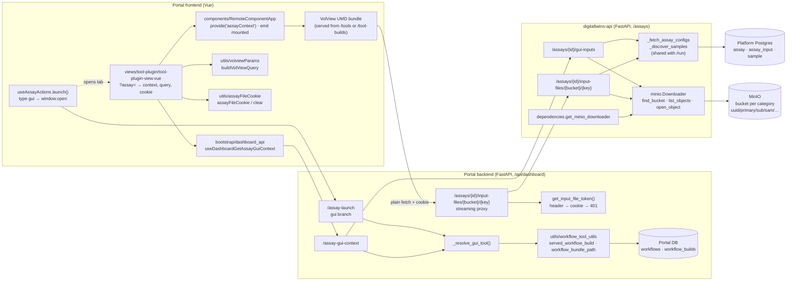
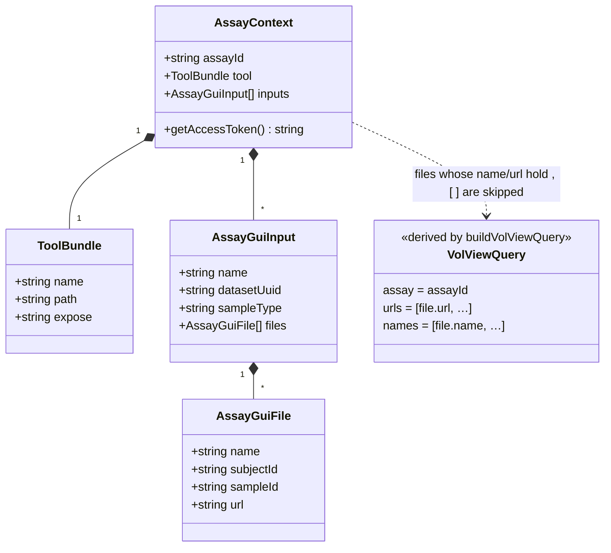

# UML: launching a gui assay with its inputs preloaded

Companion to [implementation_plan.md](implementation_plan.md), [walkthrough.md](walkthrough.md) and the ADR
`docs/decisions/2026-10-05-gui-assay-launch-input-handoff.md`. Diagrams are Mermaid (GitHub and the VS Code
Markdown preview render them).

## 1. Sequence: Launch → tool open with files loaded

```mermaid
sequenceDiagram
    autonumber
    actor U as User
    participant D as Dashboard<br/>(useAssayActions.launch)
    participant P as Portal backend<br/>/api/dashboard
    participant A as digitaltwins-api<br/>/assays
    participant DB as Portal DB<br/>(workflows, workflow_builds)
    participant T as /tool-view tab<br/>(tool-plugin-view.vue)
    participant R as RemoteComponentApp
    participant V as VolView plugin<br/>(UMD bundle)
    participant M as MinIO

    U->>D: click Launch (assay 43)
    D->>P: GET /assay-launch?seek_id=43
    P->>A: GET /assays/43?get_configs=true
    A-->>P: assay {tags:[gui], configs:{workflow_seek_id:95,…}}
    P->>DB: _resolve_gui_tool(95): WorkflowBuild.seek_id=95 → served_workflow_build → workflow_bundle_path
    alt no gui build for that workflow
        DB-->>P: none
        P-->>D: {message: "…no launchable GUI tool…"}
        D-->>U: toast
    else bundle found
        DB-->>P: {name, path, expose}
        P-->>D: {type:"gui", data:"/tool-view?assay=43"}
        D->>T: window.open(data, "_blank")
    end

    T->>P: GET /assay-gui-context?seek_id=43
    P->>A: GET /assays/43?get_configs=true
    P->>DB: _resolve_gui_tool(workflow_seek_id)
    P->>A: GET /assays/43/gui-inputs
    A->>A: _fetch_assay_configs · _discover_samples<br/>(sample_type + cohort; models skipped)
    loop each sample
        A->>M: find_bucket(dataset_uuid) · list_objects(bucket, uuid/primary/sub/sam/)
        M-->>A: keys
    end
    A-->>P: {workflow_seek_id, inputs[{name, dataset_uuid, sample_type, files[{bucket,key,name,subject_id,sample_id}]}]}
    P-->>T: {assay_id, tool{name,path,expose}, inputs[… files[{…, url:/api/dashboard/assays/43/input-files/<bucket>/<key>}]]}

    T->>T: history.replaceState(?assay=43&urls=[…]&names=[…])
    T->>T: document.cookie = dt_assay_file_token=<jwt>;<br/>path=/api/dashboard/assays/43/input-files; max-age=300
    T->>R: mount(src=tool.path, expose, context)
    R->>R: loadScript · createApp(window[expose])<br/>provide('assayContext', context)
    R->>V: mount
    V->>V: read urls/names from window.location
    R-->>T: emit mounted
    T->>T: history.replaceState(?assay=43)

    loop each url (plain fetch, same-origin → cookie sent)
        V->>P: GET /assays/43/input-files/<bucket>/<key>  [Cookie: dt_assay_file_token]
        P->>P: get_input_file_token: Authorization header, else cookie, else 401
        P->>A: GET /assays/43/input-files/<bucket>/<key>  [Bearer]
        A->>A: key under <input dataset_uuid>/primary/ and no ".."? else 403
        A->>M: open_object(bucket, key)
        M-->>A: stream, length
        A-->>P: StreamingResponse (Content-Type, Content-Length)
        P-->>V: stream
    end
    V-->>U: image rendered
    U->>T: exit / close tab
    T->>T: onBeforeUnmount: clear cookie (max-age=0)
```

## 2. Components and dependencies



## 3. Data contract handed to the tool

The portal backend returns snake_case; `bootstrap/http.ts` camelCases every response key, so the frontend
and the plugin see the camelCase shape. `RemoteComponentApp` provides it under the injection key
`assayContext`, with the portal's `getAccessToken` added for tools that fetch lazily (the cookie lives ~5 min).



### Where each piece of state lives

| State | Where | Lifetime |
|---|---|---|
| Which tool a SEEK workflow maps to | Portal DB `workflow_builds.seek_id` → `Workflow`/`WorkflowBuild` | until rebuilt / re-approved |
| Which files an assay needs | Platform Postgres (`assay_input`, `sample`) resolved per call by `_discover_samples` | per request |
| VolView's inputs | the tab's query string (`urls`, `names`), set by `replaceState` before mount, reduced to `?assay=` after mount | until the plugin has read it |
| The bearer for file fetches | cookie `dt_assay_file_token`, path `/api/dashboard/assays/<id>/input-files` | 300 s or tab unmount |
